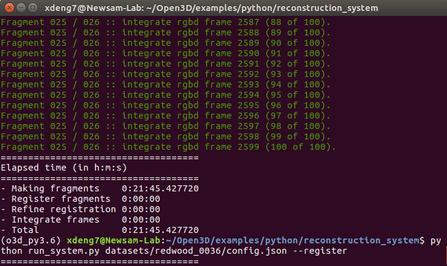
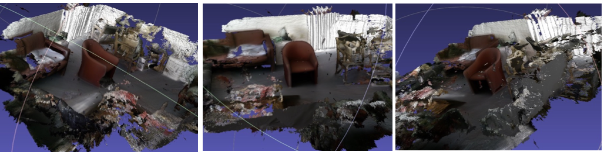
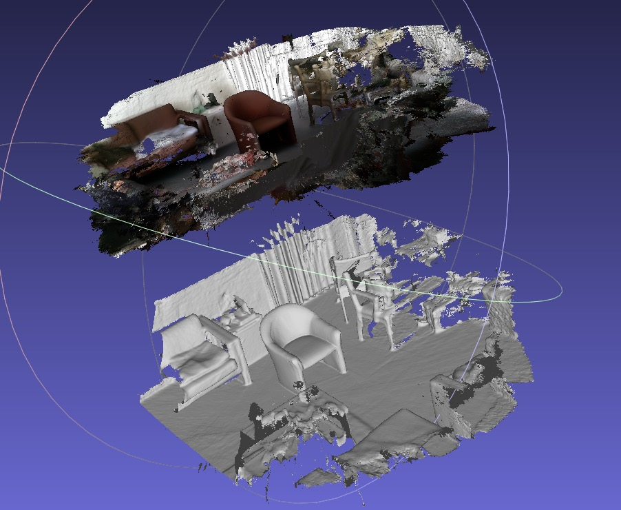
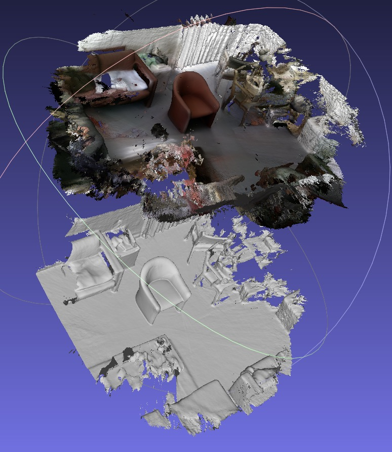

# Redwood Open3D 3D Reconstruction using RGB-D Images
An example project using Open3d for 3d reconstruction with RGB-D images

This is implemented by using the open-sourced tools [Open3D](http://www.open3d.org/). Souce code is available at (https://github.com/intel-isl/Open3D)

And the codes are heavily borrowed from the source github repo.


**System requirements:**

* Ubuntu 16.04 (not support 16.04+)
* Anaconda 4.7.11
* Python 3.6
* OpenCV
* Open3D 0.9.0 (not support 0.9.0+)

## Set up environment

```bash
# Clone the project to local machine
$ git clone https://github.com/xdeng7/redwood_open3d_3dreconstruction.git

# Install packages, need to install Anaconda if it is not installed 
$ conda create -n o3d_py3.6 python=3.6 Anaconda
$ conda activate o3d_py3.6
$ python3 -m pip install --user open3d-python
$ conda install -c conda-forge opencv

```
## Download data
Any RGB-D dataset should work. In this repo, the open-sourced dataset Redwood is used.

Data can be download at (http://redwood-data.org/3dscan/dataset.html).

Unzip the .zip file, and put the data under the folder 
```bash
'ROOT_DIR/Open3D/examples/python/reconstruction_system/datasets/YOUR_DATA_FOLDER'
```

For exmaple, my data dir is 
```bash
'/home/xdeng7/Open3D/examples/python/reconstruction_system/datasets/redwood_0036'
```

Under the data folder, the depth and rgb data should placed into two different folders. 

***Please download config.json available at [Google Drive]()***

***!! Modify line 3 in config.json with your dataset folder name.***

Please follow the directory structure as follows:


```   
├── reconstruction_system

├── ├── datasets                                                                                                                                                                          

│   │   ├── redwood_0036                                                                                                 
│   │   │   └── depth   # depth data                                                                                                                           
│   │   │   └── rgb     # rgb data        
│   |   |   └── config.json  # experimental hyperparameters
│   |   |   └── ...
│   |   ├── ...
├── ...
```

## Quick start
Four steps to build 3D reconstruction with your RGB-D data. 
* make
* register
* refine
* integrate

```bash
# The tools is in examples
cd Open3D/examples/python/reconstruction_system
# 1) create fragements
python run_system.py datasets/config.json --make
```


```bash
# 2) register fragements
python run_system.py datasets/config.json --register
```


```bash
# 3) refine fragements
python run_system.py datasets/config.json --refine
```


```bash
# 4) integrate and create the 3d mesh scene 
python run_system.py datasets/config.json --integrate
```



At last, the generated 3d ojbect is in the 'datasets/YOUR_DATA_NAME/scene/integrated.ply'

## Visualize 3D objects
[MeshLab](https://www.meshlab.net/#download) is suggested to view the 3D object. 

Ubuntu 16.04 seems to have problem using MeshLab.

Tested on Mac OS. 


The generated 3D object (integrated.ply) and ground truth (0036.ply) are avaiable at [Google Drive](https://drive.google.com/drive/folders/1AIL9V-8edG8u4jDeRic_aD79XrX9mS9U?usp=sharing)

**The integraed mesh object viewed in different perspectives is as follow**



**A comparison is made between integrated (colored) and ground truth (gray) as below**


